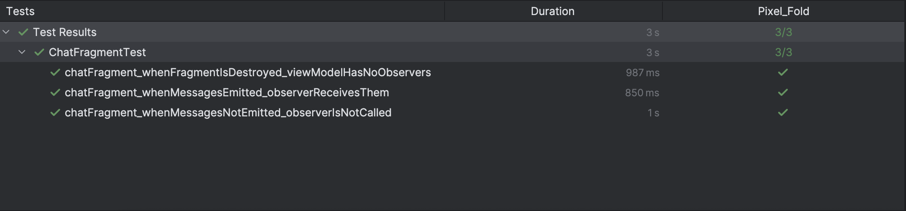

# Palm Outsourcing Task


## Lifecycle Fix and Migration Decision

### Fix Applied
I replaced the LiveData observer from using the **Activity lifecycle** to the **Fragment view lifecycle**.  
This prevents crashes and memory leaks since the fragment’s view can be destroyed while the Activity is still alive.  
LiveData should always be bound to the view’s lifecycle to avoid dangling observers.

```kotlin
// Old (causing crashes and memory leaks)
viewModel.messages.observe(requireActivity())

// New (safe and lifecycle-aware)
viewModel.messages.observe(viewLifecycleOwner)
```

### Why Not Migrating to StateFlow Yet
We’re not migrating this legacy code to Flow/StateFlow right now because:
- Migration would be time-consuming, requiring refactoring across multiple layers.
- The priority is to deliver a hotfix for the crash and memory leak.
- Using viewLifecycleOwner provides a safe and reliable fix in the short term.


## Code Review

### Observing LiveData
```kotlin
// Current (unsafe, tied to Activity lifecycle)
viewModel.messages.observe(requireActivity()) { msgs ->
    recyclerView.adapter = MessagesAdapter(msgs)
}

// Recommended (safe, tied to Fragment's view lifecycle)
viewModel.messages.observe(viewLifecycleOwner) { msgs ->
    //better performance to update only the changed items
    messagesAdapter.submitList(msgs)
}
```
### Why viewLifecycleOwner?
Using **requireActivity()** ties the observer to the Activity lifecycle.
In Fragments, the view can be destroyed or detached while the Activity is still alive.
This mismatch can cause memory leaks and crashes.
viewLifecycleOwner safely binds LiveData to the Fragment’s view lifecycle.

### RecyclerView Adapter
**Issue in current code:**
- A new MessagesAdapter is being created inside the LiveData observer.
- This means every update replaces the adapter entirely, forcing the RecyclerView to redraw the entire list.
- This causes performance issues (especially with large or frequently updating lists).
**Recommended solution:**
- Initialize the adapter once outside the observer.
- Use `ListAdapter` with `DiffUtil` and `submitList()` inside the observer.
- This ensures only the changed items are updated, improving performance and keeping code cleaner.
- Search about `ListAdapter` vs `RecyclerView.Adapter` for more details.
(to encourage junior developers to search themselves about the best solutions)

## Staged Refactor

### Stage 0 — Identify Issues
- Investigate **performance bottlenecks**, **crash root causes**, and **memory leaks**.
- Introduce monitoring SDKs:
    - [LeakCanary](https://square.github.io/leakcanary/) → detect memory leaks.
    - Firebase Crashlytics → track and analyze crashes.
    - Firebase Performance Monitoring → measure runtime performance.
- Identify the application’s **critical path** to prioritize optimizations.
- Monitor **screen loading times** on critical paths.
- Detect **God classes** (Activities or Fragments containing too much logic).

### Stage 1 — Quick Wins
- Replace `RecyclerView.Adapter` with **`ListAdapter` + `DiffUtil`**, using `submitList()` inside observers.
- Apply **memory leak fixes** and crash handling improvements.
- Deliver small, high-impact performance improvements quickly.

### Stage 2 — Paging & Flow Migration
- Migrate the **Chat screen** to **Paging 3**:
  - Avoid loading thousands of messages into the RecyclerView adapter at once.
  - Improve scrolling and memory performance.
- Maybe Introduce **Flow/StateFlow**, since Paging 3 integrates more naturally with Flows.

---
### Iterative Rollout Strategy
Stages 3–4 will be applied **incrementally per module/screen**.
- Start with a **non-critical screen** as a POC.
- Validate the approach and gather feedback.
- Roll out gradually to critical modules/screens.
---

### Stage 3 — Enforce MVVM
- Ensure **separation of concerns**:
    - Business logic → `ViewModel` or use cases.
    - UI logic → Activities/Fragments/Composables.
### Stage 4 — Clean Architecture Alignment
- Refactor **storage** and **network layers**:
    - Use **separate models** for storage, network, and domain layers.
- Reflect changes in the **repository implementation**.
- Introduce **Use Cases** in the domain layer (e.g., `SendMessageUseCase`) to encapsulate user actions.

### Stage 5 — Multi-Module Architecture
- Refactor the project into a **modular architecture**:
    - Separate features into independent modules.
    - Improve build times, reusability, and maintainability.


## Unit tests
Please note:  
If you want to run **all of your test cases**, use the following command in the terminal:
```bash
./gradlew check connectedAndroidTest
```
### Test Results Screenshot

